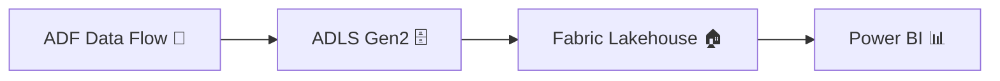
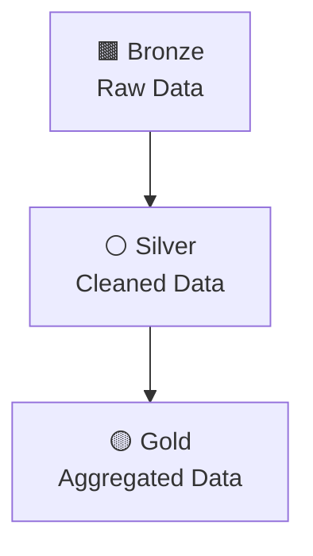

# 🚀 Azure Data Engineering Pipeline → Microsoft Fabric (Hybrid Architecture)

<p align="center">


</p>

---

## 📌 Project Overview

This project demonstrates an **end-to-end data engineering pipeline** using:

* ⚙️ **Azure Data Factory (ADF)** for ETL processing
* 🗄️ **Azure Data Lake Storage Gen2 (ADLS)** for storage
* 📊 **Microsoft Fabric (Lakehouse + OneLake Shortcut)** for analytics

✨ Implements **Medallion Architecture (Bronze → Silver → Gold)**
✨ Uses **Hybrid Integration (ADF + Fabric)**

---

## 🏗️ Architecture

### 🔹 High-Level Flow



---

### 🔹 Medallion Architecture



---

## ⚙️ Technologies Used

* Azure Data Factory (ADF)
* Azure Data Lake Storage Gen2 (HNS Enabled)
* Microsoft Fabric (Lakehouse, Dataflow Gen2)
* Power BI (optional for visualization)

---

## 📂 Data Pipeline Details

### 🔹 Source

```bash
bronze/orders/orders.csv
```

---

### 🔹 Transformations (ADF Data Flow)

✔ Derived Columns:

* `order_year`
* `order_month`
* `amount_category`

✔ Filtering:

* Remove low-value orders (`amount > 100`)

✔ Aggregation (Gold Layer):

* Total revenue per country
* Total orders count

---

### 🔹 Output

```bash
silver/orders_clean/orders_clean.csv
gold/orders_summary/orders_summary.csv
```

---

## 🔗 Hybrid Integration with Microsoft Fabric

Instead of duplicating data:

* 🔗 Fabric connects to ADLS via **OneLake Shortcut**
* ⚡ Enables **real-time access without copying data**

### 💡 Benefits

* ❌ No data duplication
* 💰 Cost-efficient
* 📈 Scalable architecture

---

## 📊 Fabric Layer

* Lakehouse created in Fabric
* Shortcuts added:

  * `silver_shortcut`
  * `gold_shortcut`

---

### 🧪 Query Example

```sql
SELECT * FROM gold_shortcut;
```

---

## 🚀 How to Run

```bash
# Upload CSV
bronze/orders/orders.csv

# Run ADF Pipeline
pl_orders_medallion

# Verify outputs
silver/orders_clean/
gold/orders_summary/
```

---

## 🧠 Key Learnings

* End-to-end ETL pipeline design
* Medallion architecture implementation
* Data transformation using ADF Data Flows
* ADLS Gen2 (HNS) importance
* Hybrid integration with Fabric

---

## 🎯 Use Cases

* Batch data processing pipelines
* Cloud-native data lake solutions
* Real-time analytics using Fabric
* Enterprise-grade workflows

---

## 🔥 Future Enhancements

* Incremental data loading
* Partitioning strategy
* Delta Lake format
* CI/CD with Azure DevOps
* Power BI dashboards

---

## 👨‍💻 Author

**Livin Vincent**
Senior Data Engineer

---

## ⭐ Support

If you like this project, give it a ⭐ and share 🚀
